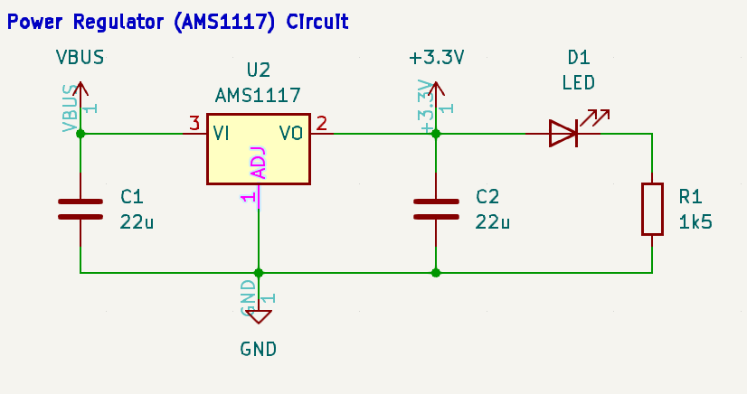
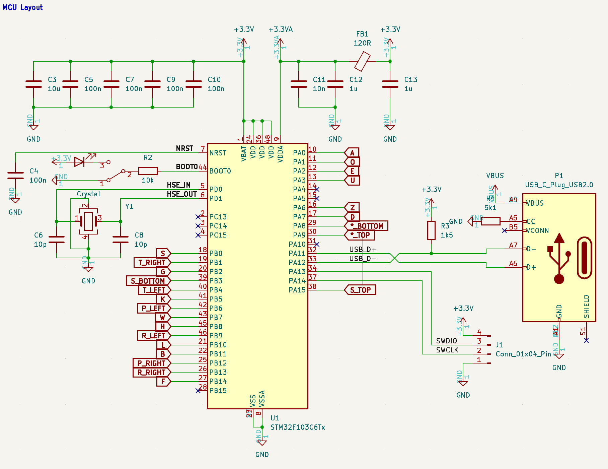
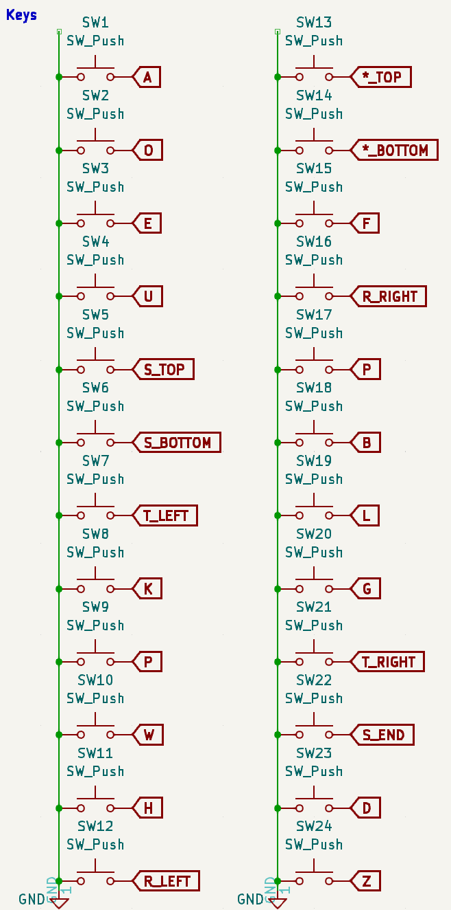

# Steno-Key

## 📖 Introduction
Welcome to the Steno-Key project! This is a custom project that I've wanted to make for a while because I've always been fascinated by stenography keyboards and the high WPMs that people can achieve with it. This README serves as an introduction to stenography keyboards, the design process with making one from scratch, and eventually a demonstration of the keyboard working.

## 🛠️ Design Approach

We will use the STM32F103 chip as the main microcontroller that handles the inputs from the Cherry switches, and we will write some firmware to handle those key inputs. More specifically, we will use the `QMK` library since they already have a built-in stenography library.

### Regulator Circuit

    

The STM32F103 chip requires an input of 3.3V. Since the USB-C port supplies a direct 5V, we need to step it down using a linear dropout regulator. Based
on the datasheet for the AMS1117 chip, we are using `22uF` capacitors to stabilize the input and output voltages for use. There's an LED at the output just
to visually verify that we indeed do have 3.3V running in the board.

### Microcontroller Peripherals

    

The STM32103 chip requires a bunch of bypass capacitors, on top of a larger bulk capacitor, on its power pins to stabilize each power pin. 
- For every VDD pin, you are required to supply a `100nF` capacitor for filtering, so in the schematic there are four `100nF` capacitors.
- For the VDDA pin, you'll need to perform a low-pass filter using a ferrite bead. This is necessary even when inputs are purely digital.
- The boot switch is connected to an SPDT which is allowed for debugging purposes with a linker. Another LED is added to determine which mode is active.
- The crystal oscillator has `10pF` capacitors on both the HSE_IN and HSE_OUT pins. The gate capacitance of the oscillator is 7pF, so (7pF - 2pF) * 5 = 10pF.
- The USB-C port is used as opposed to USB-A or USB micro B ports.
- The NRST pin is set to ground, due to lack of usage on my personal case.

### Key Switches

    

In most keyboard layouts, a keyboard matrix approach is used to reduce the number of GPIOs needed, by using columns and indices to mark each key input. However, given that this is a stenography keyboard (reduced number of keys) and the difference in typing style (chording vs. individual inputs), ghosting becomes a serious issue with the keyboard matrix approach. Instead, individual keys are mapped to their own GPIO pins as the STM32F103 chip can afford them.

## 🧩 PCB Layout

## 🖼️ 3D View

## 🧪 Physical Board / Functionality

## 💻 Code

## 🎥 Video Demo

---

Thanks for stopping by! I hope you found this documentation really informative and educational!
